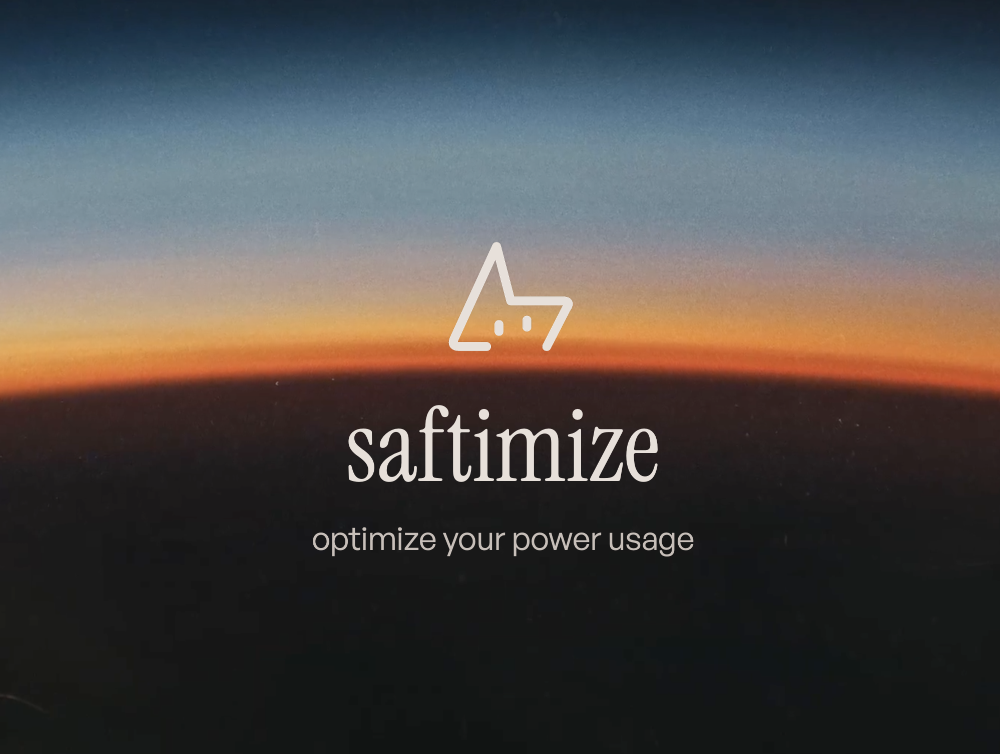

# Saftimize — Optimize your energy usage

Batch data pipeline for the HSLU Data Engineering module (DENG HS26).
It collects Swiss electricity load and price data, stores it raw and curated, and serves it to a dashboard that shows when power is likely to get expensive.

> Status: Milestone 1 (initial pitch). The pipeline is not implemented yet; this repo contains the plan and an example environment file.

## Problem and user

My household wants to monitor its electricity usage and know in advance when costs are likely to spike, so that flexible loads (dishwasher, washing machine, EV charging later) can be shifted to cheaper hours.

- **End users:** me and my family
- **Data product:** a curated, queryable table of hourly load and price per hour, plus a dashboard and later a simple price forecast
- Details: [docs/usecase.md](docs/usecase.md)

## Data source (current)

ENTSO-E Transparency Platform, Swiss bidding zone:

- actual total load (usage side)
- day-ahead prices (price side, see open question in the use-case doc)

Our own smart meters are installed in early 2027, after the final deadline. ENTSO-E is the stand-in. The pipeline is designed so the household meter can be added as a second source later without changing the layers behind it.

A Swiss weather source (Zug area) is planned as a secondary source to explain load and price.

## Architecture

See [docs/architecture.md](docs/architecture.md).

Short version:

1. Orchestrator triggers a daily batch ingestion from the ENTSO-E API
2. Raw responses land in storage (local Postgres first, Google Cloud Storage in the final version)
3. Transformations clean and join load, price and weather
4. Curated tables are served from PostgreSQL (midterm) and BigQuery (final)
5. Everything runs in Docker Compose locally, cloud resources come from Terraform

## Repository structure

| Directory | Contents |
|---|---|
| `docs/` | Use case, architecture, backlog and other project documentation |
| `src/` | Pipeline source code (planned); currently contains `.env.example` |
| `data/` | Datasets and mock data for development and testing |

## Plan

See [docs/backlog.md](docs/backlog.md).

| Milestone | Date | Goal |
|---|---|---|
| Pitch | Week 3 | Direction, README, Architecture v0.1, backlog |
| Midterm | repo due 22 Oct 2026 | Local pipeline: ingestion, Postgres, Docker Compose, orchestrator, one transformation |
| Final | repo due 10 Dec 2026 | Cloud pipeline with Terraform, GCS, BigQuery, data quality checks |

## Setup

Not available yet. Setup and verification steps will be added at the midterm; an example configuration is already in `src/.env.example`.

## Known limitations (so far)

- Total load is national, not household consumption
- The household meter is not available before the final deadline
- Wholesale prices are not the same as the retail tariff the family pays