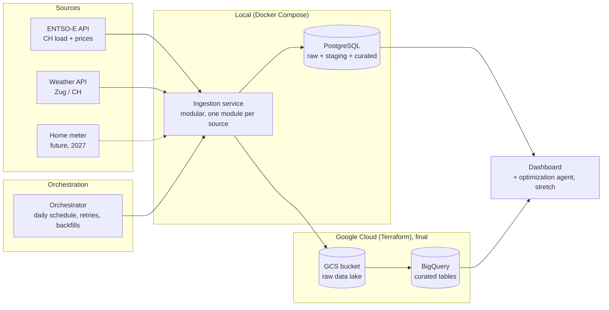

# Saftimize architecture v0.1

Status: initial plan for the pitch. Expect changes at v0.2 (midterm) and the final version.

## Overview

## Layers

| Layer | Midterm (local) | Final (cloud) |
|---|---|---|
| Ingestion | Python modules, one per source, run by the orchestrator | Same modules, writing directly to GCS (no local staging in the production path) |
| Raw storage | Raw tables in PostgreSQL | GCS bucket, files partitioned by source and date |
| Transformation | SQL/Python from raw to staging to curated | Reads from the lake, writes curated BigQuery tables |
| Serving | PostgreSQL curated tables | BigQuery, partitioned by date, clustered by series |
| Orchestration | Orchestrator in Docker Compose | Same, schedulable |
| Infrastructure | Docker Compose network | Terraform: GCS bucket, BigQuery dataset |

## Planned curated tables (grain to be finalized)

- `fct_load_hourly`: one row per hour and area
- `fct_price_hourly`: one row per hour and area
- `fct_weather_hourly`: one row per hour and location
- `dim_time`: one row per hour
- a joined feature table for forecasting: one row per hour

## Key decisions (initial)

| Decision | Choice for now | Reason |
|---|---|---|
| Load strategy | Incremental by date window with lookback | Data is append-mostly but values get revised |
| Frequency | Daily | Day-ahead prices appear once per day |
| Failure behaviour | Retry with backoff, then fail the run and alert, reruns are idempotent | Safe backfills |
| Orchestrator | Open (Airflow or Dagster candidates) | Decide at start of midterm work |
| Dashboard | Open (Looker Studio or custom web app) | Not graded directly, keep cheap |

## Division of responsibilities

Solo project, pending instructor confirmation. All components owned by one person.

## Risks

- Source API instability or token issues
- Time zone handling around daylight saving
- Scope creep from the optimization agent (kept as a stretch goal)
- Cloud cost and credentials (no secrets in the repo, `.env.example` only)